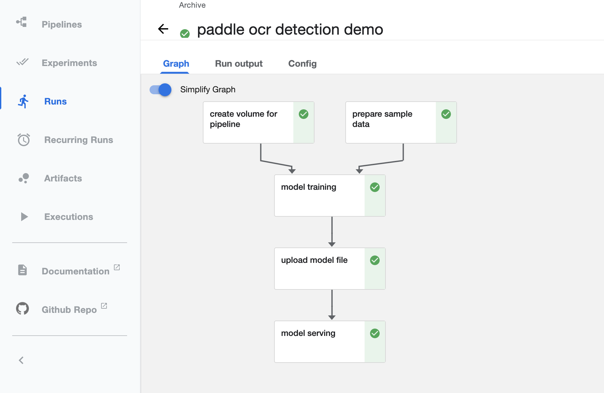

# PP-OCR Pipeline 示例

云上飞桨产品提供了多租户隔离的交互式编程 Web UI（JupyterHub），您可以通过以下命令来获取安装在集群中的 JupyterHub 服务的 IP 地址：

```bash
$ kubectl get service -n jhub
```

从上述命令中找到 public-service 对应的 ip 地址，然后访问 `http://<public-ip>:80` 链接，打开 JupyterHub UI 界面，然后创建用户名和密码即可使用。

如下图：

<div align="center">
  
</div>

以下通过 OCR 领域的文本检测场景为例，展示了 PP-OCR 模型云上训练到服务部署工作流的落地实践。

## 准备 PP-OCR Pipeline 的共享盘

由于从模型训练到模型服务部署各阶段间，会产出临时文件，比如模型训练日志、模型快照、不同格式的模型文件等，所以需要创建一个共享盘，这样工作流中各阶段任务就能够共享这些临时文件，完成整个流程。
以下为创建 Pipeline 共享盘的示例代码：

```python
import kfp
import kfp.dsl as dsl
from kfp import components

def create_volume_op():
    """
    创建 PaddleOCR Pipeline 所需的共享存储盘
    :return: VolumeOp
    """
    return dsl.VolumeOp(
        name="PPOCR Detection PVC",
        resource_name="ppocr-detection-pvc",
        storage_class="task-center",
        size="10Gi",
        modes=dsl.VOLUME_MODE_RWM
    ).set_display_name("create volume for pipeline")
```

## 准备样本数据集并缓存到集群本地

在进行模型训练任务之前，需要将样本数据从远程的存储服务中拉取到本地，并以分布式的形式缓存到训练集群的节点上，这样能够大幅加上模型训练作业的效率。这里用到的样本数据集是 icdar2015。

```python
def create_dataset_op():
    """
    将样本数据集拉取到训练集群本地并缓存
    :return: DatasetOp
    """
    dataset_op = components.load_component_from_file("./yaml/dataset.yaml")
    return dataset_op(
        name="icdar2015",
        partitions=1,                 # 缓存分区数
        source_secret="data-source",  # 数据源的秘钥
        source_uri="bos://paddleflow-public.hkg.bcebos.com/icdar2015/"  # 样本数据URI
    ).set_display_name("prepare sample data")
```

## 开始进行PP-OCR模型的训练任务

Training API 中提供开启 VisualDL 模型训练日志可视化的接口，同时还提供了模型转化和预训练模型接口，您可以通过指定相关参数来进行配置。

```python
def create_training_op(volume_op):
    """
    使用飞桨生态套件进行模型训练的组件，支持PS和Collective两种架构模式
    :param volume_op: 共享存储盘
    :return: TrainingOp
    """
    training_op = components.load_component_from_file("./yaml/training.yaml")
    return training_op(
        name="ppocr-det",
        dataset="icdar2015",  # 数据集
        project="PaddleOCR",  # Paddle生态项目名
        worker_replicas=1,    # Collective模式Worker并行度
        gpu_per_node=1,       # 指定每个worker所需的GPU个数
        use_visualdl=True,    # 是否启动模型训练日志可视化服务
        train_label="train_icdar2015_label.txt",   # 训练集的label
        test_label="test_icdar2015_label.txt",     # 测试集的label
        config_path="configs/det/det_mv3_db.yml",  # 模型训练配置文件
        pvc_name=volume_op.volume.persistent_volume_claim.claim_name,  # 共享存储盘
        # 模型训练镜像
        image="registry.baidubce.com/paddleflow-public/paddleocr:2.1.3-gpu-cuda10.2-cudnn7",
        # 修改默认模型配置
        config_changes="Global.epoch_num=10,Global.log_smooth_window=2,Global.save_epoch_step=5",
        # 预训练模型URI
        pretrain_model="https://paddle-imagenet-models-name.bj.bcebos.com/dygraph/MobileNetV3_large_x0_5_pretrained.pdparams",
    ).set_display_name("model training")
```

## 将训练好的模型上传到模型存储服务并进行版本管理

云上飞桨产品使用 Minio 组件来提供模型存储服务，您可以通过 ModelHub 相关 API 来进行版本管理。

```python
def create_modelhub_op(volume_op):
    """
    模型转换、存储、版本管理组件
    :param volume_op:
    :return:
    """
    modelhub_op = components.load_component_from_file("./yaml/modelhub.yaml")
    return modelhub_op(
        name="ppocr-det",
        model_name="ppocr-det",  # 模型名称
        model_version="latest",  # 模型版本号
        pvc_name=volume_op.volume.persistent_volume_claim.claim_name,  # 共享存储盘
    ).set_display_name("upload model file")
```

## 部署模型在线推理服务

Serving 组件支持蓝绿发版、自动扩缩容等功能，您可以通过相关参数进行配置。

```python
def create_serving_op():
    """
    部署模型服务
    :return: ServingOp
    """
    serving_op = components.load_component_from_file("./yaml/serving.yaml")
    return serving_op(
        name="ppocr-det",
        model_name="ppocr-det",  # 模型名称
        model_version="latest",  # 模型版本
        port=9292,               # Serving使用的端口
        # PaddleServing镜像
        image="registry.baidubce.com/paddleflow-public/serving:v0.6.2",
    ).set_display_name("model serving")
```

## 编译 PP-OCR Pipeline 并提交任务

通过 Python SDK 构建 PP-OCR 工作流，并将工作流提交到集群上运行。

```python
@dsl.pipeline(
    name="ppocr-detection-demo",
    description="An example for using ppocr train.",
)
def ppocr_detection_demo():
    # 创建 ppocr pipeline 各步骤所需的存储盘
    volume_op = create_volume_op()

    # 拉取远程数据（BOS/HDFS）到训练集群本地，并缓存
    dataset_op = create_dataset_op()
    dataset_op.execution_options.caching_strategy.max_cache_staleness = "P0D"

    # 采用Collective模型分布式训练ppocr模型，并提供模型训练可视化服务
    training_op = create_training_op(volume_op)
    training_op.execution_options.caching_strategy.max_cache_staleness = "P0D"
    training_op.after(dataset_op)

    # 将模型转换为 PaddleServing 可用的模型格式，并上传到模型中心
    modelhub_op = create_modelhub_op(volume_op)
    modelhub_op.execution_options.caching_strategy.max_cache_staleness = "P0D"
    modelhub_op.after(training_op)

    # 从模型中心下载模型，并启动 PaddleServing 服务
    serving_op = create_serving_op()
    serving_op.execution_options.caching_strategy.max_cache_staleness = "P0D"
    serving_op.after(modelhub_op)
 
if __name__ == "__main__":
    import kfp.compiler as compiler

    pipeline_file = "ppocr_detection_demo.yaml"
    compiler.Compiler().compile(ppocr_detection_demo, pipeline_file)
    client = kfp.Client(host="http://www.my-pipeline-ui.com:80")
    run = client.create_run_from_pipeline_package(
        pipeline_file,
        arguments={},
        run_name="paddle ocr detection demo",
        service_account="pipeline-runner"
    )
```

## PP-OCR Pipeline 示例

<div align="center">
  
</div>

## 模型训练日志可视化

<div align="center">
  
</div>

## 模型存储于版本管理

<div align="center">
  
</div>
